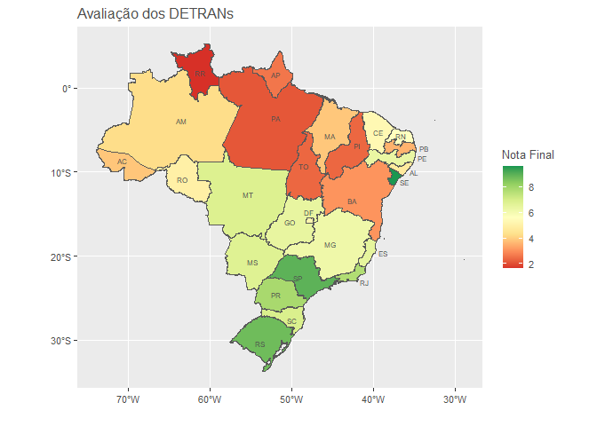

# Revisão da Análise dos DETRANs

## Descrição

Este repositório é destinado a revisar as planilhas utilizadas para o
cálculo das métricas de avaliação para a qualidade dos serviços de
informação dos Departamentos Estaduais de Trânsito (DETRAN) de cada
unidade federativa brasileira.

## Resultados

| UF  | Frota | Condutores | Infrações | Acidentes | Atendimento | Educação | CFCs | Nota |
|:----|------:|-----------:|----------:|----------:|------------:|---------:|-----:|-----:|
| SE  | 10.00 |       8.90 |     10.00 |     10.00 |        8.35 |    10.00 | 10.0 | 9.61 |
| RS  |  8.90 |       8.90 |      8.90 |      7.80 |       10.00 |    10.00 |  6.7 | 8.74 |
| SP  |  8.90 |       8.90 |      8.90 |      7.80 |       10.00 |     8.35 | 10.0 | 8.98 |
| GO  |  8.90 |       8.90 |      8.90 |      0.00 |        3.35 |     5.00 | 10.0 | 6.44 |
| SC  |  8.90 |       8.90 |      8.90 |      6.67 |        5.00 |     3.30 |  6.7 | 6.91 |
| RN  |  7.77 |       7.77 |      7.77 |      4.43 |        5.00 |     6.70 |  0.0 | 5.63 |
| PR  |  7.77 |       6.67 |      7.77 |      7.77 |        5.00 |    10.00 | 10.0 | 7.85 |
| RJ  | 10.00 |       4.43 |      8.90 |      5.57 |        5.00 |    10.00 | 10.0 | 7.70 |
| MS  |  8.90 |       6.67 |     10.00 |      0.00 |        5.00 |    10.00 |  6.7 | 6.75 |
| MT  |  5.53 |       5.53 |      7.77 |      5.53 |        8.35 |     8.35 |  6.7 | 6.82 |
| PE  |  8.90 |       8.90 |      6.67 |      0.00 |        3.35 |    10.00 |  6.7 | 6.36 |
| MG  |  5.53 |       5.53 |      5.53 |      0.00 |       10.00 |    10.00 |  6.7 | 6.19 |
| DF  |  5.53 |       5.53 |      0.00 |      5.53 |        3.35 |    10.00 |  6.7 | 5.24 |
| ES  |  7.77 |       5.53 |      7.77 |      4.43 |        3.35 |     6.70 | 10.0 | 6.51 |
| CE  |  6.67 |       6.67 |      2.20 |      0.00 |        5.00 |     6.70 | 10.0 | 5.32 |
| RO  | 10.00 |      10.00 |      0.00 |     10.00 |        3.35 |     1.65 |  0.0 | 5.00 |
| AC  |  3.30 |       3.30 |      0.00 |      2.20 |        1.65 |    10.00 |  6.7 | 3.88 |
| AL  |  7.77 |       0.00 |      0.00 |      8.90 |        3.35 |     3.30 | 10.0 | 4.76 |
| AM  |  3.30 |       3.30 |      0.00 |      3.30 |        3.35 |    10.00 |  6.7 | 4.28 |
| MA  |  8.90 |       0.00 |      0.00 |      0.00 |        3.35 |     8.35 |  6.7 | 3.90 |
| PB  |  5.53 |       5.53 |      0.00 |      2.20 |        1.65 |     3.30 |  6.7 | 3.56 |
| BA  |  3.30 |       3.30 |      0.00 |      0.00 |        3.35 |     5.00 |  6.7 | 3.09 |
| AP  |  0.00 |       0.00 |      0.00 |      0.00 |        1.65 |     6.70 | 10.0 | 2.62 |
| PA  |  0.00 |       0.00 |      0.00 |      0.00 |        5.00 |    10.00 |  0.0 | 2.14 |
| TO  |  0.00 |       0.00 |      0.00 |      0.00 |        5.00 |     5.00 |  6.7 | 2.39 |
| PI  |  0.00 |       0.00 |      3.30 |      0.00 |        1.65 |     5.00 |  6.7 | 2.38 |
| RR  |  0.00 |       0.00 |      0.00 |      0.00 |        1.65 |     3.30 |  6.7 | 1.66 |

### Anotações

- Detran - GO
  - Não fornece nenhum dado de acidentes
  - Não foram encontrados dados estatísticos de atendimento
  - Canais de atendimento não possuem opção de mensagem
- Detran - SC
  - Não foram encontradas estatísticas de atendimento ao cliente
- Detran - RN
  - Acidentes possuem anos faltantes
  - Não foi encontrada lista de CFC
- Detran - PR
  - Não foram encontradas estatísticas de atendimento
- Detran - RJ
  - Não foram encontradas estatísticas de atendimento
- Detran - MS
  - Portal de estatísticas atualmente indisponível
- Detran - AL
  - Estatísticas de condutores e infrações em construção
- Detran - MA
  - Apesar de possuir dados de frota, o servidor não responde
- Detran - AP
  - Arquivos de dados não podem ser visualizados
- Detran - PA
  - Todos os sistemas de distribuição de dados em desenvolvimento
- Detran - TO
  - Arquivos de dados não podem ser visualizados
