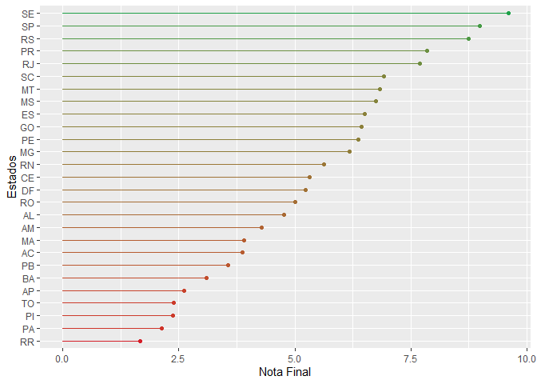

# Revisão da Análise dos DETRANs

## Descrição

Este repositório é destinado a revisar as planilhas utilizadas para o
cálculo das métricas de avaliação para a qualidade dos serviços de
informação dos Departamentos Estaduais de Trânsito (DETRAN) de cada
unidade federativa brasileira.

## Resultados

| UF  |     Frota | Condutores | Infrações | Acidentes | Atendimento | Educação | CFCs |     Nota |
|:----|----------:|-----------:|----------:|----------:|------------:|---------:|-----:|---------:|
| SE  | 10.000000 |   8.900000 | 10.000000 | 10.000000 |        8.35 |    10.00 | 10.0 | 9.607143 |
| RS  |  8.900000 |   8.900000 |  8.900000 |  7.800000 |       10.00 |    10.00 |  6.7 | 8.742857 |
| SP  |  8.900000 |   8.900000 |  8.900000 |  7.800000 |       10.00 |     8.35 | 10.0 | 8.978571 |
| GO  |  8.900000 |   8.900000 |  8.900000 |  0.000000 |        3.35 |     5.00 | 10.0 | 6.435714 |
| SC  |  8.900000 |   8.900000 |  8.900000 |  6.666667 |        5.00 |     3.30 |  6.7 | 6.909524 |
| RN  |  7.766667 |   7.766667 |  7.766667 |  4.433333 |        5.00 |     6.70 |  0.0 | 5.633333 |
| PR  |  7.766667 |   6.666667 |  7.766667 |  7.766667 |        5.00 |    10.00 | 10.0 | 7.852381 |
| RJ  | 10.000000 |   4.433333 |  8.900000 |  5.566667 |        5.00 |    10.00 | 10.0 | 7.700000 |
| MS  |  8.900000 |   6.666667 | 10.000000 |  0.000000 |        5.00 |    10.00 |  6.7 | 6.752381 |
| MT  |  5.533333 |   5.533333 |  7.766667 |  5.533333 |        8.35 |     8.35 |  6.7 | 6.823810 |
| PE  |  8.900000 |   8.900000 |  6.666667 |  0.000000 |        3.35 |    10.00 |  6.7 | 6.359524 |
| MG  |  5.533333 |   5.533333 |  5.533333 |  0.000000 |       10.00 |    10.00 |  6.7 | 6.185714 |
| DF  |  5.533333 |   5.533333 |  0.000000 |  5.533333 |        3.35 |    10.00 |  6.7 | 5.235714 |
| ES  |  7.766667 |   5.533333 |  7.766667 |  4.433333 |        3.35 |     6.70 | 10.0 | 6.507143 |
| CE  |  6.666667 |   6.666667 |  2.200000 |  0.000000 |        5.00 |     6.70 | 10.0 | 5.319048 |
| RO  | 10.000000 |  10.000000 |  0.000000 | 10.000000 |        3.35 |     1.65 |  0.0 | 5.000000 |
| AC  |  3.300000 |   3.300000 |  0.000000 |  2.200000 |        1.65 |    10.00 |  6.7 | 3.878571 |
| AL  |  7.766667 |   0.000000 |  0.000000 |  8.900000 |        3.35 |     3.30 | 10.0 | 4.759524 |
| AM  |  3.300000 |   3.300000 |  0.000000 |  3.300000 |        3.35 |    10.00 |  6.7 | 4.278571 |
| MA  |  8.900000 |   0.000000 |  0.000000 |  0.000000 |        3.35 |     8.35 |  6.7 | 3.900000 |
| PB  |  5.533333 |   5.533333 |  0.000000 |  2.200000 |        1.65 |     3.30 |  6.7 | 3.559524 |
| BA  |  3.300000 |   3.300000 |  0.000000 |  0.000000 |        3.35 |     5.00 |  6.7 | 3.092857 |
| AP  |  0.000000 |   0.000000 |  0.000000 |  0.000000 |        1.65 |     6.70 | 10.0 | 2.621429 |
| PA  |  0.000000 |   0.000000 |  0.000000 |  0.000000 |        5.00 |    10.00 |  0.0 | 2.142857 |
| TO  |  0.000000 |   0.000000 |  0.000000 |  0.000000 |        5.00 |     5.00 |  6.7 | 2.385714 |
| PI  |  0.000000 |   0.000000 |  3.300000 |  0.000000 |        1.65 |     5.00 |  6.7 | 2.378571 |
| RR  |  0.000000 |   0.000000 |  0.000000 |  0.000000 |        1.65 |     3.30 |  6.7 | 1.664286 |

### Anotações

- Detran - GO
  - Não fornece nenhum dado de acidentes
  - Não foram encontrados dados estatísticos de atendimento
  - Canais de atendimento não possuem opção de mensagem
- Detran - SC
  - Não foram encontradas estatísticas de atendimento ao cliente
- Detran - RN
  - Acidentes possuem anos faltantes
  - Não foi encontrada lista de CFC
- Detran - PR
  - Não foram encontradas estatísticas de atendimento
- Detran - RJ
  - Não foram encontradas estatísticas de atendimento
- Detran - MS
  - Portal de estatísticas atualmente indisponível
- Detran - AL
  - Estatísticas de condutores e infrações em construção
- Detran - MA
  - Apesar de possuir dados de frota, o servidor não responde
- Detran - AP
  - Arquivos de dados não podem ser visualizados
- Detran - PA
  - Todos os sistemas de distribuição de dados em desenvolvimento
- Detran - TO
  - Arquivos de dados não podem ser visualizados
